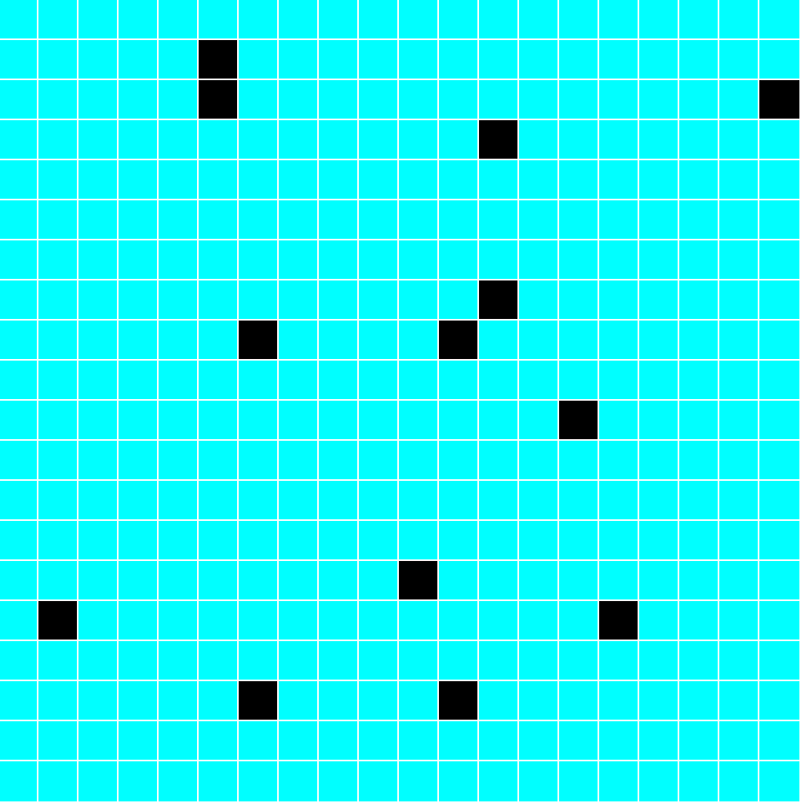

## maze-sfml

Maze generator in C++ with sfml graphics rendering.

## Installing

Make sure you have [sfml lib](https://www.sfml-dev.org/download/sfml/2.5.1/) installed. Once you have it set up depending on your platform

## Build

`make`

## Running

- `./maze`
- Type `q` to quit
- Type `n` to generate a new maze

You should expect to see a window similar to this one, where the cyan squares represent floor in the maze and the black ones represent wall:

